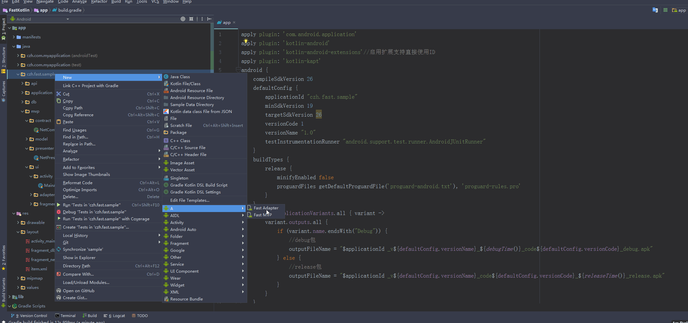

## FastKotlin

用于自己快速开发的框架，加入了许多项目通用的东西，免去重复造轮子,待完善。。。

kotlin常用插件 JsonToKotlinClass同java的GsonFormat

use Gradle:

```
repositories {
  maven { url "https://jitpack.io" }
  mavenCentral()
  google()
}
dependencies {
  implementation 'com.github.czh235285:FastKotlin:1.3.6'
}
```
## 介绍

* 一个简单的Demo，初学kotlin的可以看看,kotlin+rxjava2+retrofit2+mvp
* 沉浸式状态栏，浅色状态栏。
* 大量常用工具类，扩展函数
* 网络请求用的 [xsnow](https://github.com/xiaoyaoyou1212/XSnow)（基于Retrofit2二次封装的框架，缓存方面封装比较好，直接拿来用了）
* 数据库 [dbflow](https://github.com/Raizlabs/DBFlow)(目前最好用的安卓数据库，lib中未添加，具体用法可以看demo)
* 通用adapter [BaseRecyclerViewAdapterHelper](https://github.com/CymChad/BaseRecyclerViewAdapterHelper)
* 圆角/圆形图片 [roundimageview](https://github.com/RaphetS/RoundImageView)(支持圆角图片、圆形图片、椭圆图片)
* 下拉刷新/上拉加载库 [SmartRefreshLayout](https://github.com/scwang90/SmartRefreshLayout)
* 6.0动态权限申请 [acp](https://github.com/mylhyl/AndroidAcp)

## 一键生成MVP代码
下载项目中的FastMVP.zip解压到指定目录。

例如  C:\Program Files\Android\Android Studio1\plugins\android\lib\templates\activities

C:\Program Files\Android\Android Studio1是你的AS安装路径




加载图片:

```

一行代码简单调用

imageView.load(url)  

```

跳转Activity:

```

不带参数
warpActivity<OtherActivity>()  或者
warpActivityForResult<OtherActivity>(500)

传值
warpActivity<OtherActivity>("id" to 1,"name" to "姓名")  或者
warpActivityForResult<OtherActivity>(500,"id" to 1,"name" to "姓名")

OtherActivity获取参数

val id=intent.extras.getInt("id")
val name=intent.extras.getString("name")

```

Dialog:

```

一行代码简单调用

 showDialog("提示语")  或者
 showDialog("提示语",{ //确定按钮操作})

```

网络请求加载动画:

```

仿百度加载动画
 showLoading()
 stopLoading()

```